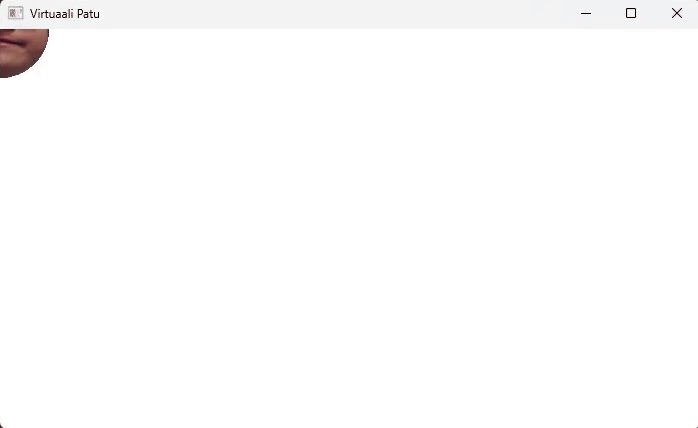

# Virtuaali-Patu


## Description
Virtuaali-Patu is a JavaFX-based application that simulates virtual pet interactions. It includes a graphical user interface (GUI) for managing and interacting with virtual pets.

## Prerequisites
Before you begin, ensure you have the following installed on your system:
- Java Development Kit (JDK) 17 or higher
- Apache Maven
- JavaFX SDK (if not bundled in the JAR)

## Setup Instructions

### 1. Clone the Repository
Clone this repository to your local machine:
```
git clone <repository-url>
```

### 2. Build the Project
Navigate to the project directory and build the application using Maven:
```
cd virtuaali-patu
mvn clean package
```
This will generate a fat JAR file in the `target/` directory.

### 3. Run the Application
To run the application, execute the following command:
```
java -jar target/virtuaali-patu-1.jar
```

If you encounter issues with JavaFX, ensure the JavaFX SDK is installed and run the application with:
```
java --module-path "path/to/javafx-sdk/lib" --add-modules javafx.controls,javafx.fxml -jar target/virtuaali-patu-1.jar
```
Replace `path/to/javafx-sdk/lib` with the actual path to your JavaFX SDK.

## Features
- Manage virtual pets
- Interactive GUI built with JavaFX

## Contributing
Feel free to fork this repository and submit pull requests for new features or bug fixes.
